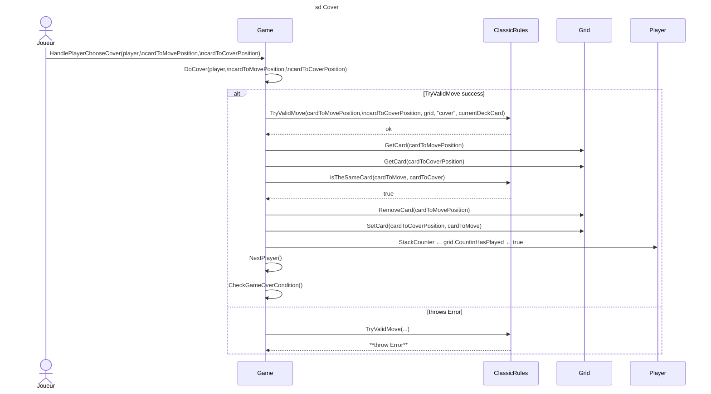

# Diagramme de séquence – Action COVER

```mermaid
sequenceDiagram
    title sd Cover

    actor Joueur
    participant Game
    participant ClassicRules
    participant Grid
    participant Player

    Joueur ->> Game : HandlePlayerChooseCover(player,\ncardToMovePosition,\ncardToCoverPosition)
    Game ->> Game : DoCover(player,\ncardToMovePosition,\ncardToCoverPosition)

    alt TryValidMove success
        Game ->> ClassicRules : TryValidMove(cardToMovePosition,\ncardToCoverPosition, grid, "cover", currentDeckCard)
        ClassicRules -->> Game : ok

        Game ->> Grid : GetCard(cardToMovePosition)
        Game ->> Grid : GetCard(cardToCoverPosition)
        Game ->> ClassicRules : isTheSameCard(cardToMove, cardToCover)
        ClassicRules -->> Game : true

        Game ->> Grid : RemoveCard(cardToMovePosition)
        Game ->> Grid : SetCard(cardToCoverPosition, cardToMove)
        Game ->> Player : StackCounter ← grid.Count\nHasPlayed ← true
        Game ->> Game : NextPlayer()
        Game ->> Game : CheckGameOverCondition()
    else throws Error
        Game ->> ClassicRules : TryValidMove(...)
        ClassicRules -->> Game : **throw Error**
    end
```