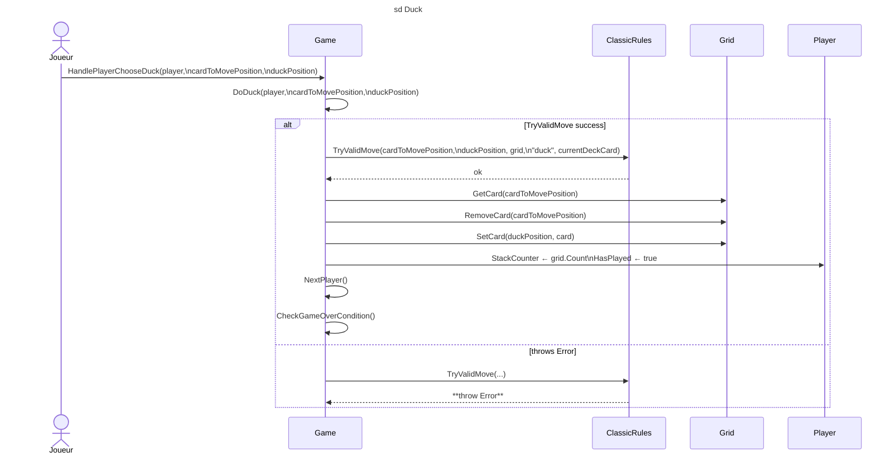

# Diagramme de séquence – Action DUCK

```mermaid
sequenceDiagram
    title sd Duck

    actor Joueur
    participant Game
    participant ClassicRules
    participant Grid
    participant Player

    Joueur ->> Game : HandlePlayerChooseDuck(player,\ncardToMovePosition,\nduckPosition)
    Game ->> Game : DoDuck(player,\ncardToMovePosition,\nduckPosition)

    alt TryValidMove success
        Game ->> ClassicRules : TryValidMove(cardToMovePosition,\nduckPosition, grid,\n"duck", currentDeckCard)
        ClassicRules -->> Game : ok

        Game ->> Grid : GetCard(cardToMovePosition)
        Game ->> Grid : RemoveCard(cardToMovePosition)
        Game ->> Grid : SetCard(duckPosition, card)
        Game ->> Player : StackCounter ← grid.Count\nHasPlayed ← true
        Game ->> Game : NextPlayer()
        Game ->> Game : CheckGameOverCondition()
    else throws Error
        Game ->> ClassicRules : TryValidMove(...)
        ClassicRules -->> Game : **throw Error**
    end
```