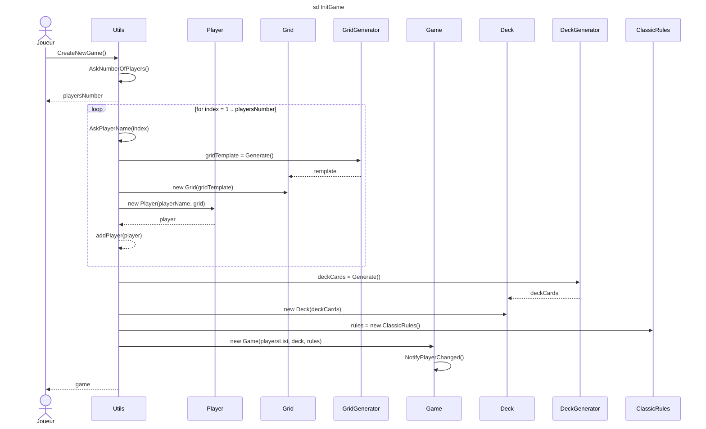

# Diagramme de séquence – Initialisation du jeu

```mermaid
sequenceDiagram
    title sd InitGame

    actor Joueur
    participant Utils
    participant Player
    participant Grid
    participant GridGenerator
    participant Game
    participant Deck
    participant DeckGenerator
    participant ClassicRules

    Joueur ->> Utils : CreateNewGame()
    Utils ->> Utils : AskNumberOfPlayers()
    Utils -->> Joueur : playersNumber

    loop for index = 1 .. playersNumber
        Utils ->> Utils : AskPlayerName(index)
        Utils ->> GridGenerator : gridTemplate = Generate()
        GridGenerator -->> Grid : template
        Utils ->> Grid : new Grid(gridTemplate)
        Utils ->> Player : new Player(playerName, grid)
        Player -->> Utils : player
        Utils -->> Utils : addPlayer(player)
    end

    Utils ->> DeckGenerator : deckCards = Generate()
    DeckGenerator -->> Deck : deckCards
    Utils ->> Deck : new Deck(deckCards)

    Utils ->> ClassicRules : rules = new ClassicRules()
    Utils ->> Game : new Game(playersList, deck, rules)
    Game ->> Game : NotifyPlayerChanged()
    Utils -->> Joueur : game
```