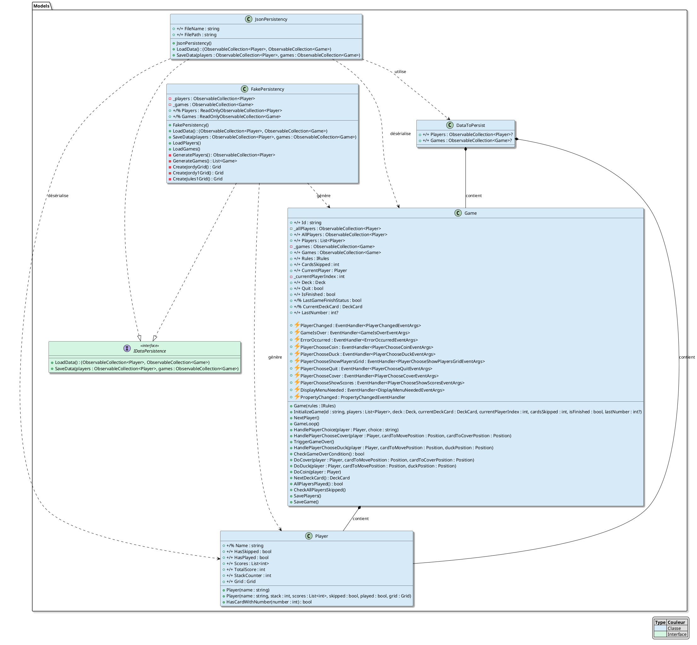

# Explication du Diagramme de Classes de Persistance

Ce diagramme représente l'architecture de la persistance des données dans l'application DuckAndCover. Il met en évidence les différentes classes et interfaces impliquées dans la sauvegarde et le chargement des données du jeu.

## Structure Principale

### 1. Interface IDataPersistence
L'interface `IDataPersistence` définit le contrat que doivent respecter toutes les implémentations de persistance :
- `LoadData()` : Méthode pour charger les données (joueurs et parties)
- `SaveData()` : Méthode pour sauvegarder les données

### 2. Implémentations de la Persistance

#### JsonPersistency
Cette classe gère la persistance des données au format JSON :
- Utilise `DataToPersist` comme structure intermédiaire
- Gère la sérialisation/désérialisation des objets `Player` et `Game`
- Stocke les données dans un fichier JSON

#### FakePersistency
Cette classe simule la persistance des données pour les tests et le développement :
- Génère des données fictives pour les joueurs et les parties
- Implémente des méthodes spécifiques pour la génération de données de test
- Permet de tester l'application sans dépendre d'un système de stockage réel

### 3. Structure de Données

#### DataToPersist
Classe conteneur qui structure les données à persister :
- Contient des collections de `Player` et `Game`
- Sert d'intermédiaire pour la sérialisation JSON

### 4. Classes Métier

#### Player
Représente un joueur avec ses attributs :
- Informations personnelles (nom)
- État du jeu (scores, grille, etc.)
- Méthodes de gestion du jeu

#### Game
Représente une partie de jeu avec :
- Gestion des joueurs
- État de la partie
- Événements du jeu
- Méthodes de gestion de la partie

## Relations et Interactions

1. **Relations d'Implémentation**
   - `FakePersistency` et `JsonPersistency` implémentent `IDataPersistence`
   - Chaque implémentation fournit sa propre logique de persistance

2. **Relations de Composition**
   - `DataToPersist` contient des collections de `Player` et `Game`
   - `Game` contient une collection de `Player`

3. **Relations de Dépendance**
   - `JsonPersistency` utilise `DataToPersist` pour la sérialisation
   - `FakePersistency` génère des instances de `Player` et `Game`

## Points Forts de l'Architecture

1. **Flexibilité**
   - Interface commune permettant différentes implémentations
   - Facilité d'ajout de nouvelles méthodes de persistance

2. **Séparation des Responsabilités**
   - Claires séparations entre la persistance et la logique métier
   - Structure modulaire facilitant la maintenance

3. **Testabilité**
   - `FakePersistency` permet des tests sans dépendance externe
   - Architecture facilitant les tests unitaires
